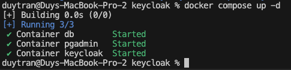

## Bước 1:

Chỉnh sữa file trên Linux và Mac `/etc/hosts`

```
127.0.0.1 keycloak.localhost
```

Trên Windows, đường dẫn file thường là:

```
c:\Windows\System32\Drivers\etc\hosts
```

## Bước 2:

Chuẩn bị tệp soạn thảo docker (ví dụ: docker-compose.yml). Đảm bảo bạn đặt `Dockerfile` và `docker-compose.yml` trong cùng một thư mục.

```yaml
version: "3.9"
services:
  postgres:
    container_name: db
    image: "postgres:14.4"
    healthcheck:
      test: ["CMD", "pg_isready", "-q", "-d", "postgres", "-U", "root"]
      timeout: 45s
      interval: 10s
      retries: 10
    volumes:
      - postgres_data:/var/lib/postgresql/data
      - ./sql:/docker-entrypoint-initdb.d/:ro # turn it on, if you need run init DB
    environment:
      POSTGRES_USER: postgres
      POSTGRES_PASSWORD: postgres
      POSTGRES_DB: keycloak
      POSTGRES_HOST: postgres
    networks:
      - local
    ports:
      - "5432:5432"

  pgadmin:
    container_name: pgadmin
    image: "dpage/pgadmin4:5.1"
    environment:
      PGADMIN_DEFAULT_EMAIL: postgres@domain.local
      PGADMIN_DEFAULT_PASSWORD: postgres
    ports:
      - "5050:80"
    networks:
      - local

  keycloak:
    container_name: keycloak
    build:
      context: .
      args:
        KEYCLOAK_VERSION: 22.0.4
    command: ["start", "--optimized"]
    environment:
      JAVA_OPTS_APPEND: -Dkeycloak.profile.feature.upload_scripts=enabled
      KC_DB_PASSWORD: postgres
      KC_DB_URL: jdbc:postgresql://postgres/keycloak
      KC_DB_USERNAME: postgres
      KC_HEALTH_ENABLED: "true"
      KC_HTTP_ENABLED: "true"
      KC_METRICS_ENABLED: "true"
      # KC_HOSTNAME: keycloak.localhost
      # KC_HOSTNAME_PORT: 8180
      KC_HOSTNAME_URL: http://keycloak.localhost:8180
      KC_PROXY: reencrypt
      KEYCLOAK_ADMIN: admin
      KEYCLOAK_ADMIN_PASSWORD: admin
    ports:
      - "8180:8080"
      - "8787:8787" # debug port
    networks:
      - local

networks:
  local:
    name: local
    driver: bridge

volumes:
  postgres_data:
```

## Bước 3:

Chạy lệnh docker compose:

```
docker compose build --no-cache keycloak
```


```
docker compose up -d
```



## Bước 4:

Kiểm tra các container đang chạy

```
docker compose ps
```


Khi start thành công rồi thì ta vào đường dẫn http://keycloak.localhost:8180 để test


Đăng nhập vào bảng điều khiển dành cho quản trị viên bằng tên người dùng quản trị viên và mật khẩu.

<b> Tên người dùng: </b> admin

<b> Mật khẩu: </b>admin


Bằng cách làm theo các bước này, bạn sẽ có thể chạy Keycloak với cơ sở dữ liệu PostgreSQL bên ngoài cục bộ bằng Docker.

<b> Tài liệu tham khảo </b>

- https://medium.com/@ozbillwang/run-keycloak-locally-with-docker-compose-db9a9f2fb437
